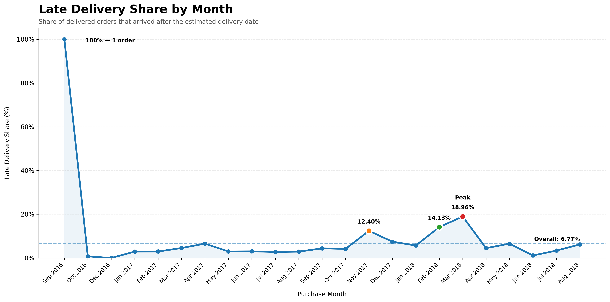

# **Late Deliveries & What Customers Say**

## **1. The Problem in your Own Words**

This project looks at late deliveries in an e-commerce dataset and how they affect customer experience.

The main questions are:

- How many orders were delivered late?
- Which months had a higher share of late deliveries?
- Do late deliveries receive lower review scores?
- What do customers complain about in their review comments?
- Are customer complaints different for late and on-time orders?

The goal is to turn the order and review data into simple findings that can help the Head of Operations reduce delivery problems and improve customer experience.

---

## **2. Assumptions**

- The analysis uses the Olist Brazilian E-Commerce Public Dataset.
- Only the `orders`, `order_items`, and `order_reviews` files are used for Parts A–C.
- The analysis is performed at the **order level**, with one row representing one delivered order.
- An order is considered late when the actual delivery date is after the estimated delivery date.
- Orders delivered on or before the estimated delivery date are treated as on time.
- Order value is calculated as the sum of `price + freight_value` for all items in the order.
- Orders without a customer delivery date are excluded from the final delivered-order analysis.
- For Part C, the LLM is given a fixed list of five themes and must assign one theme to each review.
- The manual validation checks 30 reviews using a translator.

---

## **3. Data Source and How to Run**

### **Data Source**

The dataset was downloaded from Kaggle:

**Brazilian E-Commerce Public Dataset by Olist**

Source: https://www.kaggle.com/datasets/olistbr/brazilian-ecommerce

The downloaded dataset contains multiple CSV files. For Parts A–C, only these three original files are used:

- `olist_orders_dataset.csv`
- `olist_order_items_dataset.csv`
- `olist_order_reviews_dataset.csv`

The optional Data Platform extra also uses:

- `olist_sellers_dataset.csv`

The downloaded data files are kept out of the GitHub repository using `.gitignore`.

### **Packages**

The project uses:

- Python
- DuckDB
- Groq API
- `groq`
- `python-dotenv`
- `matplotlib`

### **Setup**

Create and activate a virtual environment if required, then install the packages:

```bash
pip install duckdb groq python-dotenv matplotlib
```

### **Groq API Key**

Create a `.env` file in the project root and add:

```text
GROQ_API_KEY=your_groq_api_key
```

The API key is loaded using `python-dotenv`.


### **Order to Run**

Run the scripts from the project root in the following order:

```bash
python src\part_a.py
python src\part_b.py
python src\part_c.py
python src\part_c_validation.py
python src\part_c_theme_mix.py
python src\optional_seller.py
```

## **4. Part A: Cleaning Rules and Checks**

### **Cleaning Rules**

- Loaded the three required files: `olist_orders_dataset.csv`, `olist_order_items_dataset.csv`, and `olist_order_reviews_dataset.csv`.
- Aggregated `order_items` by `order_id` to calculate the number of items and order value.
- Calculated order value as the sum of `price + freight_value` for each order.
- Aggregated `order_reviews` by `order_id` to calculate the average review score.
- Joined the aggregated item and review data to the orders data using `order_id`.
- Kept only orders with `order_status = delivered` and a non-null customer delivery date.
- Calculated `days_late` as the number of days between the estimated delivery date and actual delivery date. Orders delivered on or before the estimated date were assigned `0`.
- Aggregated order items and reviews separately before joining them to avoid counting an order multiple times.

### **Rows Affected**

- Original orders: **99,441 rows**
-  Rows excluded from the final delivered-order analysis: **2,971 rows**
- Final delivered orders used for analysis: **96,470 rows**
- Aggregating order items and reviews changed the data to one row per order and did not remove orders from the source data.

### **Checks**

| Check | Result |
|---|---:|
| Duplicate order IDs | **0** |
| Delivered dates before purchase dates | **0** |
| Order value mismatches | **0** |

All three required checks passed:

- Order ID is unique.
- No delivered date occurs before the purchase date.
- Order value equals the sum of the order's items.


## **5. Part B: Key Numbers and Charts**

### **Share of Orders Delivered Late**

- Total delivered orders: **96,470**
- Late orders: **6,534**
- Late share: **6.77%**

**Explanation:** **6.77% of delivered orders were delivered after the estimated delivery date.**

### **Late Share by Month**



**Explanation:** **Late delivery rates varied by month, with the highest late share reaching 18.96% in March 2018.**

### **Average Review Score: Late vs On-Time**

| Delivery Status | Average Review Score |
|---|---:|
| Late | **2.27** |
| On-Time | **4.29** |

**Explanation:** **Late orders had a much lower average review score than on-time orders, showing that late delivery is associated with poorer customer reviews.**

### **Average Review Score for Orders More Than 7 Days Late**

- Orders more than 7 days late: **2,781**
- Average review score: **1.70**

**Explanation:** **Orders delivered more than seven days late had an average review score of 1.70, indicating a particularly poor customer experience.**


## **6. Part C: Model or Tool, Prompt, Checking, and Accuracy**

### **Model / Tool Used**

Used the **Groq API** with the `openai/gpt-oss-20b` model to classify customer review comments.

A total of **200 reviews containing a comment** were classified.

Each review was assigned exactly one of the five required themes:

1. `late/not received`
2. `wrong/missing item`
3. `product quality`
4. `good experience`
5. `other`

The model also generated a **one-line English summary** for each review.

### **Prompt**

The same prompt was used for every batch of reviews.

The prompt used in `src/part_c.py` was:

```text
Classify each customer review into exactly ONE
of these five categories:

1. late/not received
2. wrong/missing item
3. product quality
4. good experience
5. other

For every review, also provide a one-line
English summary.

Important rules:

- Use exactly ONE category per review.
- Do not create new categories.
- The category must be the exact category name.
- Do NOT return category numbers.
- Keep the summary short.
```


### **Manual Validation**

30 reviews were manually checked using a translator.

The validation result was:

- **26 reviews classified correctly**
- **4 reviews classified incorrectly**
- **Accuracy: 86.67%**

The incorrect classifications were retained in the validation output rather than being removed or changed.

### **Theme Mix: Late vs On-Time**

The classified reviews were compared based on whether the related order was late or on-time.
8 reviews had an unknown delivery status and were excluded from the late vs on-time percentage comparison.

| Theme | Late | On-Time |
|---|---:|---:|
| late/not received | **64.71%** | **7.43%** |
| wrong/missing item | **11.76%** | **13.71%** |
| product quality | **5.88%** | **17.71%** |
| good experience | **17.65%** | **55.43%** |
| other | **0.00%** | **5.71%** |

**Explanation:** Late-order reviews were much more likely to mention late or not received issues, while good experience was the most common theme for on-time orders.

## **7. Limitations and What I Would Do Next**

### **Limitations**

- The dataset contains historical e-commerce data from **2016–2018**, so the results may not represent current delivery performance.
- The AI review analysis was performed on **200 reviews**, so it does not represent all customer reviews in the dataset.
- The manual AI validation was performed on **30 reviews**, so the reported accuracy is based on a limited validation sample.
- Some review comments were unclear or could not be clearly linked to delivery timing.

### **What I Would Do Next**

- Analyze more recent delivery data to understand current delivery performance.
- Validate the AI review classification on a larger sample of customer reviews.
- Investigate sellers with consistently high late-delivery rates and identify the main causes of delays.
- Analyze delivery performance by location or other operational factors to identify areas that need improvement.

---

## **8. How I Used AI Tools**

AI tools were used during the project to help with **code development, debugging, understanding requirements, and reviewing the approach**.

For Part C, the **Groq API** with the `openai/gpt-oss-20b` model was used to classify **200 customer reviews** into the five required themes and generate a one-line English summary for each review.

The same fixed prompt was used for each batch of reviews. The AI-generated classifications were then manually checked on **30 reviews using a translator**.

The validation result was:

- **26 reviews classified correctly**
- **4 reviews classified incorrectly**
- **Accuracy: 86.67%**

The incorrect classifications were retained in the validation output rather than being removed or changed.


## **9. Optional Extra**

### **Data Platform Extra: Seller-Level Late Delivery Analysis**

Completed the **Data Platform optional extra** by adding the `olist_sellers_dataset.csv` file.

Calculated the late-delivery share for each seller using sellers with a minimum of **50 orders**.

The output contains:

- `seller_id`
- `total_orders`
- `late_orders`
- `late_share_percentage`

The final result contains **425 sellers** meeting the minimum order requirement after joining with valid delivered orders.

Output file:

`outputs/optional_seller_late_share.csv`